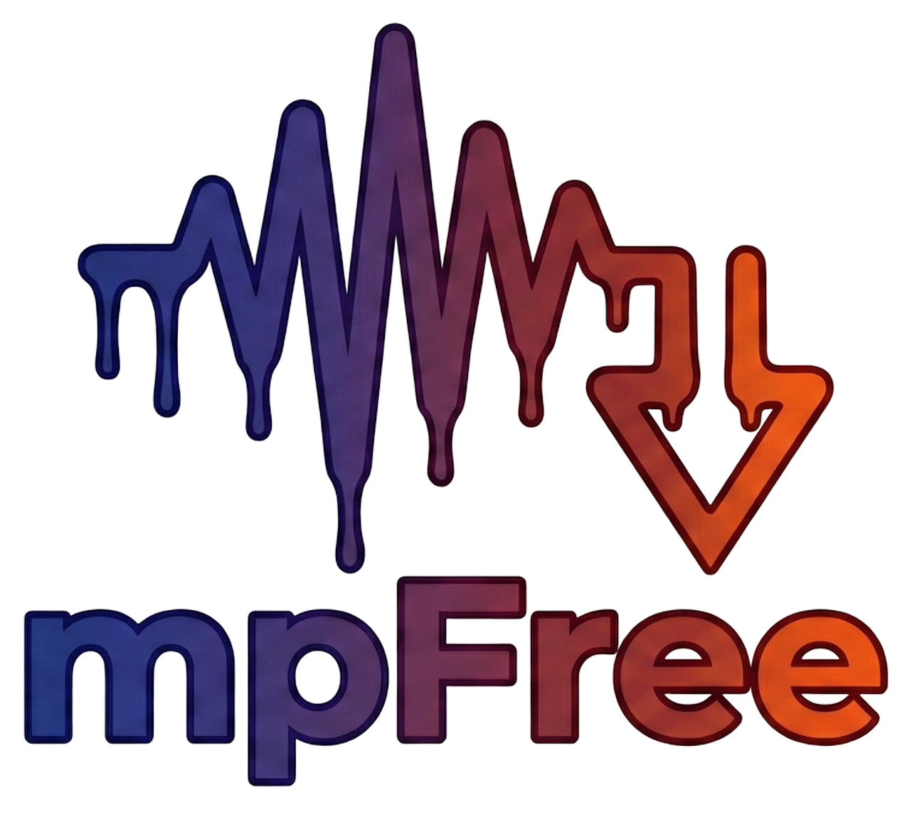

**MpFree** is a minimalist YouTube-to-MP3 downloader built with **Rust** and the **egui** framework. 


## Features
* **Native Performance:** Built for speed, memory safety and minimal overhead compared to interpreted alternatives.
* **Multi-Environment Support:** Available both for Windows and Linux. 
* **Minimalist Interface:** Clean, distraction-free GUI, without ads or bloat.
* **Zero-Dependency Design:** Binaries are bundled directly within the executable, for a plug-and-play user experience.

> Also visit the [Changelog](CHANGELOG.md) for a list of future features and updates.

### Technical Implementation
* **Rust Ecosystem:** Developed using modern crates for robust error handling and efficient message passing.
* **Real-Time Feedback:** Uses MPSC channels for cross-thread status updates.
* **Async Architecture:** Asynchronous background processing ensures long-running downloads don't freeze the main thread.


## Installation Guide

MpFree is a portable, single-binary application. This means you don't need to install any external dependencies like Python, `yt-dlp`, or `FFmpeg`. Everything is packed inside the executable.

### Windows
1. Download `mpfree.exe` from the **Releases** page.
2. Move it to a folder of your choice (e.g., Desktop or Downloads).
3. Double-click to run.

> **Note:** Since the app is unsigned, Windows Defender will show a "Windows protected your PC" warning. Click **More info** and then **Run anyway**.

---

### Linux

1. Download `mpfree` from the **Releases** page.
2. Open your terminal and navigate to the download folder.
3. Give it execution permissions:

```bash
chmod +x mpfree
```

4. Run it:

```bash
./mpfree
```
